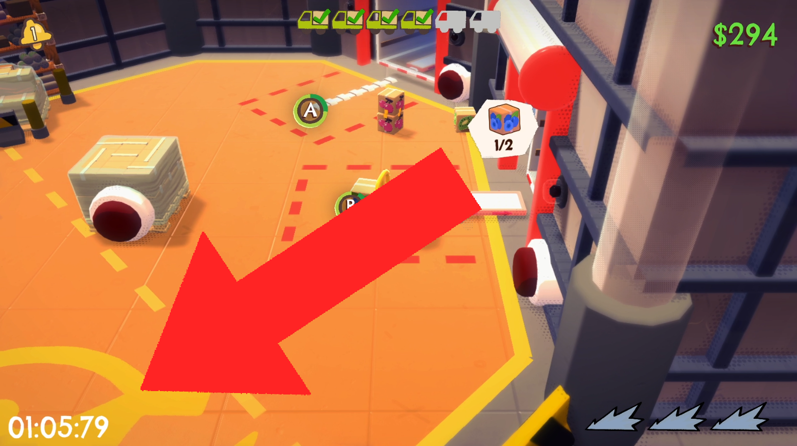
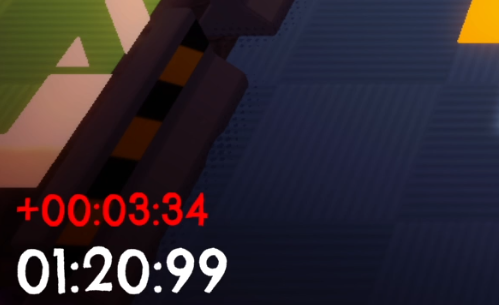
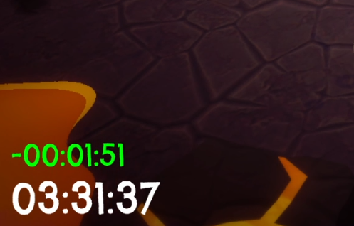
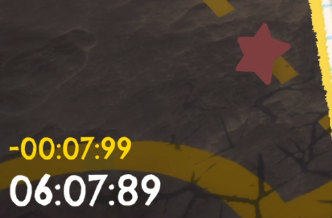
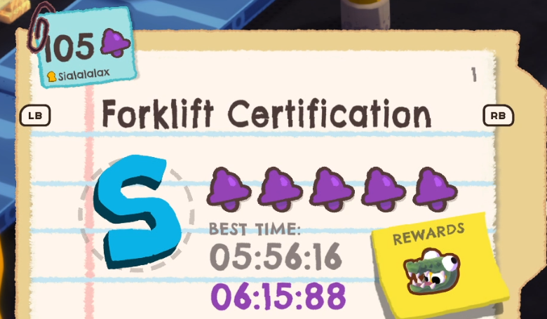

# Speedrun Mod for Crashout Crew

This mod adds a live timer along with a delta timer. The delta timer allows for a simple imitation of the LiveSplit program. The time is measured exactly like the built-in game timer (it only measures the duration of shifts). Best split times are saved, which allows you to compare your current attempt with your best one. This is helpful when you want to speedrun the game. Additionally, there is an option for quick level restarting and exiting to the menu.

## Screenshots

**In-Game Timer & Delta Comparisons:**

**Menu Integration:**

## Features

* Live Timer & Delta Timer: Measures active shift time and compares it against your best saved splits.
* Menu UI: Displays your personal best time from mod's saved splits in the level selection menu.
* Quick Reset: A dedicated keybind to instantly start a run or safely abort it.
* Configurable: Toggle visibility, adjust text sizes, change colors, and rebind keys.

## Requirements

* BepInEx (version 5.x)

## Installation

1. Install BepInEx in your game directory.
2. Download `SpeedrunMod.dll` from the Releases page.
3. Place the `.dll` file into the `BepInEx/plugins/` folder.
4. Launch the game. The config and save files will be generated automatically.

## Controls

* Quick Reset (Default: F9):
  * When used in the lobby, it forces a quick start for the next run.
  * When used during an active run, it immediately aborts the mission and safely returns you to the lobby menu.
  * The key can be changed in the configuration file.

## Configuration

The mod creates a configuration file at `BepInEx/config/com.sialala.speedrun.cfg` after the first launch. You can edit it with any text editor to:
* Enable or disable the main timer, delta timer, or menu PB display.
* Change the Quick Reset key.
* Adjust font sizes.
* Change text colors using standard HEX codes.

## Save Data

Personal bests and best segments are saved in `SpeedrunSplits.json` inside the `BepInEx/plugins/` folder. You can back up, share, or delete this file to reset your times.